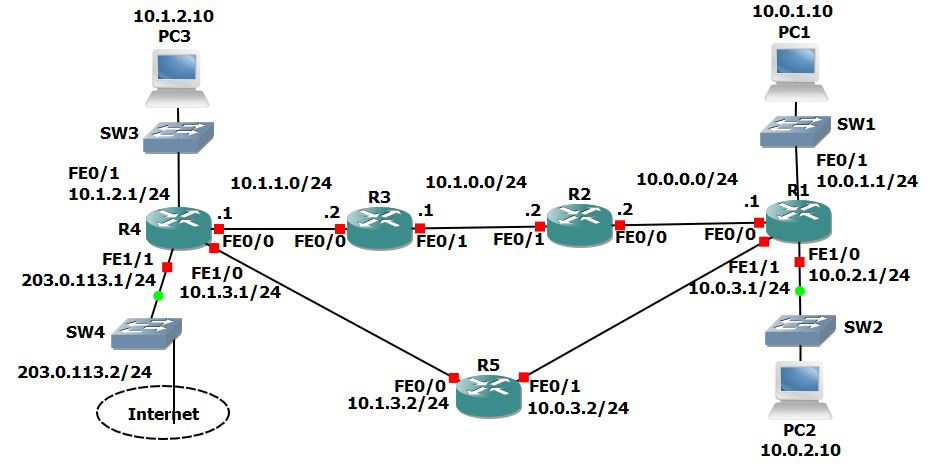

ip-routing

Routing Fundamentals Lab – Static, Summary & Default Routing

This lab demonstrates key routing techniques in a multi-router network, including connected routes, local routes, static routing, route summarization, longest prefix match, and default routing. It showcases step-by-step configuration of routers and verification of end-to-end communication across a simulated network.

---

Lab Objectives

- Configure hostnames and interface IP addresses on routers
- Observe connected and local routes using the routing table
- Configure static routes for full network communication
- Use `ping` and `tracert` to verify connectivity
- Apply route summarization for routing table efficiency
- Use longest prefix match to influence route selection
- Implement default routes to simulate internet access
- Test load balancing using multiple default paths

---

Topology Overview

The network consists of five routers (R1–R5), several switches (SW1–SW3), and end devices (PC1–PC3). Each router is connected using point-to-point links, and each PC resides on a separate subnet. All routing is manually configured using static routes.

---

## Router Configuration Summary

On R1:
- Fa0/0: 10.0.0.1 /24
- Fa0/1: 10.0.1.1 /24
- Fa1/0: 10.0.2.1 /24
- Fa1/1: 10.0.3.1 /24

On R2:
- Fa0/0: 10.0.0.2 /24
- Fa0/1: 10.1.0.2 /24

On R3:
- Fa0/1: 10.1.0.1 /24
- Fa0/0: 10.1.1.2 /24

On R4:
- Fa0/0: 10.1.1.1 /24
- Fa0/1: 10.1.2.1 /24
- Fa1/0: 10.1.3.1 /24

---

Static Routing Configuration

To enable full communication across the network, the following static routes were configured:

On R1:
- Route to 10.1.0.0/24 via 10.0.0.2
- Route to 10.1.1.0/24 via 10.0.0.2
- Route to 10.1.2.0/24 via 10.0.0.2
- Route to 10.1.3.0/24 via 10.0.0.2

On R2:
- Routes to 10.0.1.0, 10.0.2.0, and 10.0.3.0 via 10.0.0.1
- Routes to 10.1.1.0, 10.1.2.0, and 10.1.3.0 via 10.1.0.1

On R3:
- Routes to 10.0.0.0, 10.0.1.0, 10.0.2.0, and 10.0.3.0 via 10.1.0.2
- Routes to 10.1.2.0 and 10.1.3.0 via 10.1.1.1

On R4:
- Routes to 10.1.0.0, 10.0.0.0, 10.0.1.0, 10.0.2.0, and 10.0.3.0 via 10.1.1.2

---

PC Configuration & Ping Tests

PC1 and PC2 were on directly connected subnets of R1, and PC3 was on a subnet behind R4. After applying static routes, all PCs successfully pinged each other:

- PC1 to PC2: Success
- PC1 to PC3: Success
- PC2 to PC3: Success

---

## Summary Routing

Static routes on R1 were removed and replaced with a summary route:

- 10.1.0.0/16 via 10.0.0.2

This restored connectivity to all remote subnets using a single route entry.

---

Longest Prefix Match Routing

R5 was introduced, and traffic to its 10.1.3.0/24 network was routed via R1 > R2 > R3 > R4 > R5 due to the summary route. To optimize return traffic, R5 added a summary route:

- 10.0.0.0/16 via 10.0.3.1

To optimize outbound traffic from R1 to R5:

- R1 added a more specific route: 10.1.3.0/24 via 10.0.3.2

This ensured the shortest path was used in both directions due to the longer prefix match.

---

## Default Routing and Load Balancing

R4 was configured with an internet-facing IP (203.0.113.1). To simulate internet access, default routes were added on all routers:

- R1 default route via 10.0.0.2 and also 10.0.3.2 (for load balancing)
- R2, R3, R4, and R5 default routes were added via their respective next-hop IPs

Load balancing was verified on R1’s routing table showing two default paths.

---

Final Outcome

- Full connectivity across all PCs and networks
- Correct traffic flow verified with `ping` and `tracert`
- Use of longest prefix match optimized routing decisions
- Default route and load balancing simulated internet access
- Routing table optimized using a summary route

---

 What I Learned

- Subnet planning and interface consistency are crucial
- Static routing requires full end-to-end route awareness
- Summarization simplifies routing tables without losing reachability
- Routers choose routes using the longest prefix match
- Load balancing with multiple default routes improves resilience
- `ping`, `tracert`, and `show ip route` are essential verification tools

---

